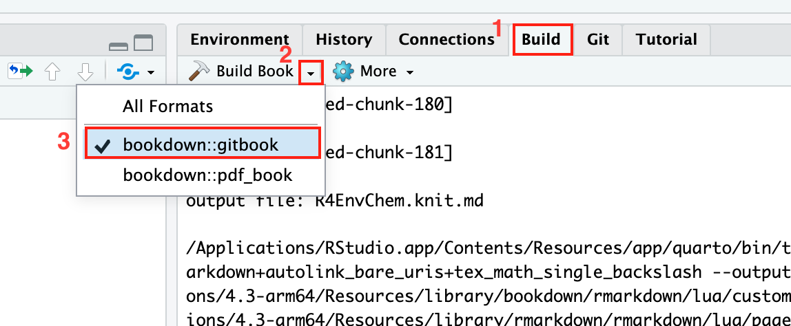

# R for Environmental Chemistry

Developing course material and workflows based in R for undergraduate UofT Environmental Chemistry courses.

Online book found here: <https://uoftchem-teaching.github.io/R4EnvChem/>.

## How to make updates to the book

1.  Clone this repository:

    ```console
    $ git clone https://github.com/UofTChem-Teaching/R4EnvChem.git
    ```

2.  Open R4EnvChem project from RStudio.

3.  Run the following command in the Console to install the necessary libraries for this book:

    ```r
    renv::restore()
    ```

4.  Build the book in HTML format in the upper-right **Build** window in RStudio, selecting the "bookdown::gitbook" option.

    

    If you encounter an error with no package installed issue, install the missing packages first. During the building process, a new file `R4EnvChem.Rmd` is automatically created.
    Once the book is built (it can take up to couple minutes), the html of the book will show up in the `Viewer` window.
    
    All the build-related files created during the process will be deleted once the HTML viewer appears. 

5.  Make changes by modifying the source files under the `src/` folder. Each time you make a change, you should rebuild the book (Step 4) to verify that your changes are rendered correctly.

6.  When you are ready, publish your changes to GitHub. You can do this using [git commit](https://github.com/git-guides/git-commit) and [git push](https://github.com/git-guides/git-push), or using the [GitHub Desktop application](https://desktop.github.com/download/).

    This GitHub repository is configured to automatically render and publish changes directly to the [live online textbook](https://uoftchem-teaching.github.io/R4EnvChem/), though it may take a few minutes to do so.
    Track progress on the repository [Deployments page](https://github.com/UofTChem-Teaching/R4EnvChem/deployments).
    For details, look at [`.github/workflows/gh-pages.yml`](https://github.com/UofTChem-Teaching/R4EnvChem/blob/main/.github/workflows/gh-pages.yml).

## Exercises

The chapter exercises are stored under the `exercises` folder.
A separate copy of all exercises are stored in the [R4EnvChem-Exercises](https://github.com/UofTChem-Teaching/R4EnvChem-Exercises) repository; we use a separate repository so that we can provide an [nbgitpuller](https://nbgitpuller.readthedocs.io/en/latest/) link to students to quickly load all exercises into the [University of Toronto JupyterHub](https://r.datatools.utoronto.ca) computing environment.
Solutions for all exercises are found in the [R4EnvChem-Instructor](https://github.com/UofTChem-Teaching/R4EnvChem-instructor) repostory (contact Jessica D'eon for access).

**Note**: with multiple copies of exercises, it's important to keep them all up to date!
Changes to exercises should first be done in the instructor repository (to ensure reference solutions are also updated), and then the parallel changes should be made to the student-facing versions in this repository and in the R4EnvChem-Exercises repository.

### Automated testing

Each exercise is accompanied by an R script containing tests for the exercise.
After completing the exercise, you can run the R script to check that the tests all pass, meaning you've completed the exercise correctly.
